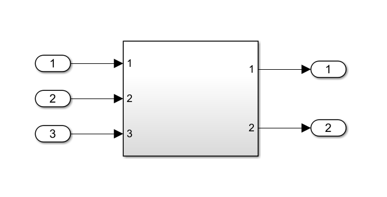

# Bus structure

One main part of this package is the generation of bus structures for the inport and outport of the MATLAB Simulink model. Sadly, this is required for the model compilation. The function iterates recursively through the model and supports the following features:
- "Inport" and "Bus Element" support
- Goto Labels
- Connections to multiple subsystems or blocks

The function is also optimized to reduce the complexity of the bus structure by removing duplicate elements. However, MATLAB seems to have introduced some strange compilation dependencies and the FMU compilation fails sometimes. To aviod this issue it is recommended to wrap your whole system inside one subsystem on the top level and connect "inports" and "outports" to the connections. Your model should look somethink like this:


## Troubleshoot

The matlab engine has some error while running `getports`. This is related to existing bus definitions within the model. Simply run the following code to reset all signal to inherit:

```matlab
path = 'your_model_name'

inports = find_system(path,'LookUnderMasks','on',...
    'FollowLinks','on', 'BlockType','Inport');
outports = find_system(path,'LookUnderMasks','on',...
    'FollowLinks','on', 'BlockType','Outport');
ports = cat(1, inports, outports);
for i = 1 : length(ports)
    set_param(ports{i},'OutDataTypeStr','Inherit: auto');
end
```

---
During the FMU compilation the error `The specified key is not present in this container` occurs. This is related to internal MATLAB issues. Just pack your model inside a subsystem as mentioned above and this should work.