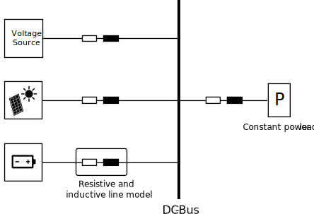

# Abstract
Innovative systems of the recent years highly depend on electronic circuits and their control. This complexity also comes with additional effort in development, testing and manufacturing. Therefore, it is often not economical to build the first prototype of a system in hardware and instead simulation based approaches are chosen. MATLAB [@matlab] is commercial software that allows companies to perform quick prototyping, mathematical analyses and the Simulink toolbox allows performing simulations. Also, a reinforcement learning (RL) toolbox for MATLAB and Simulink is available. However, the toolbox is heavily under development and many recent RL innovations are not available since MATLAB is often not the preferred choice for machine learning in academia and companies. Nevertheless, many companies and researchers use the great simulation capabilities of Simulink and use it to build their custom simulation libraries. StableRLS allows using those existing Simulink models to perform RL in Python. It handles the conversion of the model and provides a Python user interface build on the Gymnasium library for RL.

# Introduction
Simulation based approaches are actively used in various engineering applications and allow modifying systems and instantly observe the resulting changes in behavior. StableRLS (Stable Reinforcement Learning for Simulink) is a software framework integrating Simulink simulation models into the Python library Gymnasium [@gymnasium] to perform RL. In this paper the framework is presented from the perspective of electrical engineering, but Simulink is for example also used in communication engineering, control, signal processing, robotics, driving assistance and digital twins. Therefore, this framework is not only relevant for the simulation of electrical grids but also other disciplines. StableRLS does not require any modifications to be used for any other discipline as long as the Simulink models can be exported as C-code, which is usually the case.

Simulink is a graphical editor that allows modeling various components of a system, and it provides many prebuild blocks, algorithms and physical systems by default. However, the RL interface is modified at each release and sometimes does not behave as expected. Typically, Python is used for RL tasks in combination with Gymnasium [@gymnasium] which is a framework providing a standard API to communicate between RL algorithms and environments. The environment is typically a simulation and often difficult to create directly in Python. Various different tools try to simplify the difficult process, which is often prone to errors. Currently, no performant interface between Simulink and Python is available, pointing out the need for StableRLS. The paper is organized as follows. 
First the state of the art is summarized, existing frameworks are introduced and a short performance comparison is presented. Afterward, the main features of the framework are presented, and the API is introduced. Last, we showcase a usage example from the domain of electrical engineering. For additional information, examples, and contributions, please refer to the documentation of the StableRLS package.

## Reinforcement learning overview
RL is a field of the machine learning domain that focuses on training one or multiple agents to make decisions in an environment to maximize their cumulative reward. The agent repeatedly interacts with the environment by means of actions and therewith influences the state of the environment. The agent receives feedback in the form of rewards or penalties for each action. The goal of the agent is to learn a policy that leads to the highest possible cumulative reward. The research interests can be divided in developing environments that the agent can interact with and developing algorithms for the agent to converge quickly to an optimal solution by means of the policy. Especially, formulating algorithms that are applicable to a vast set of environments is challenging. OpenAI developed a framework in 2016 called gym [@gym] that defines the API interface between the agent and the environment. Recently, OpenAI stopped the development and the Farma Foundation overtook the development by maintaining a package named Gymnasium [@gymnasium]. One of the reasons for RL's growing popularity is its ability to tackle complex problems that are difficult to solve using traditional programming or supervised learning methods. RL excels in situations where the optimal solution is not known in advance, and the agent needs to learn through exploration and exploitation. For example, it has found applications in robotics, healthcare, finance, energy management, logistics, game playing and many other domains. [@sutton2018reinforcement]

# State of the art
In the literature, other authors already tried to simplify the process of creating environments for RL in Python. In [@henry2021gym] the authors introduced a customizable Gym OpenAI environment, but it is focussed on electrical grids and the class based definition of the power grid is not reasonable for large grids. The authors in [@marot2021learning], [@fan2022powergym] and [@henri2020pymgrid] proposed similar frameworks, but all of them lack the expandability to other domains and usage of an easy-to-use modeling interface.
For example, in [@heid2020omg] the authors proposed a framework called OMG which is similar to StableRLS for the Modelica modeling environment [@fritzon2018openmodelica]. However, the learning curve of Modelica is steep, creating the need for an easy-to-use modeling environment that can be combined with Gymnasium to perform RL. Similar to the OMG framework, StableRLS uses Functional Mock-up Units (FMUs). A FMU is a standardized file format to exchange and integrate simulation models across different simulation tools. An FMU contains a dynamical model combined with mathematical equations and has input and outputs. The implementation of StableRLS uses the Functional Mock-up Interface (FMI) 2.0 standard [@FMI2020], which defines data exchange formats and the structure.

# Proposed framework - StableRLS
StableRLS uses the internal capabilities of MATLAB to compile a Simulink model to an FMU. However, the capabilities of MATLAB to compile FMUs are highly limited and require model modification. In general, the effort to compile an existing model is so high that it often makes more sense to start from scratch. StableRLS solves this issue by modifying Simulink models automatically and compile those models to an FMU. MATLAB requires a user defined signal bus structure and especially for large simulation models the definition is error-prone because all nested input signals have to be defined correctly and since the input to the simulation model correlates to the action structure of the agent it is often required to modify the signal structure while working on a RL problem. StableRLS creates the bus structure for any Simulink model and also works with signals connected to multiple blocks, GoTo blocks and nested structures. As a result, the user only has to create the environment model in Simulink and don't need to worry about the conversion of the model to an FMU.

While working on StableRLS we also put effort into comparing different methods to combine Simulink simulation models and Python Gymnasium. Nameley, the TCP/IP interface and the implemented Python interface which is called MATLAB engine. In general, Simulink doesn't allow changing simulation parameters during the simulation and therefore the simulation has to wait for the actions of the agent at each time step. As a result, it is required to pause the Simulink simulation between each interaction of the agent. This is the case for both interface options mentioned above. The only difference is how the data between the Simulink simulation and Python is exchanged. We found that pausing and restarting the simulation mainly determines the resulting performance, and the time for data transmission can be neglected. Therefore, the performance of the MATLAB engine and the TCP/IP method is almost identical and only the performance of StableRLS package and the internal Python interface is compared in the table below. It can be seen that StableRLS is above 900 times faster because it uses the benefits of FMUs. 

: Caption Performance comparison between this package and the common alternative. The simulation time was 500 seconds, with a step size of 0.2 seconds.

+-------------------+-----------------+
|                   | Simulation Time | 
+===================+=================+
| StableRLS         | 0.049s          |
+-------------------+-----------------+
| Start-stop-method | 45.13s          |
+-------------------+-----------------+

\autoref{fig:overview} represents the general structure of the framework. The Simulink simulation model is converted to an FMU and integrated in StableRLS. Before the conversion can start the StableRLS package prepares the Simulink model since many requirements regarding the input and output signal definition must be met. The resulting FMU model is ready to run in any FMU simulator. In our case the FMU interacts with StableRLS following the definitions of the Gymnasium API [@gymnasium] to provide an environment for an RL agent. Nevertheless, the strucutre and behavior of the StableRLS package is as flexible as possible to account for different RL learning strategies and usecases. Please refere to our documentation for a detailed explanation of all features. 
To start the training process of the agent a config file must be specified containing the basic information about the environment (simulation duration, step time, path of the FMU). This file is used to create a child of the StableRLS base class. In addition, all addtional parameters specified in this file are available within the resulting class. Finally, we implemented functionalities to account for specific requirements. For example when working with external data for the environment, like weather data, it is necessary to read this between every simulation step. Therefore, it is important to note that the simulation step size doesn't have to be identical with the step size of the agent. As a result, the simulation could run with a step time of 0.1 seconds but the agend only cooses an action every 1.5 seconds. To integrate external data into the model, the user can simply overwrite the existing function "FMU_external_input(self)". Other examples for such general functionalities are the export of data and definition of action and observation spaces. Internally StableRLS is a custom environment for the Gymnasium Python package and exploits the functionalities of PyFMI [@andersson2016pyfmi] to simulate the FMU. 

{ width=1400px }

# Example use case: Electrical microgrid
To demonstrate the usage of the package, we chose a small electrical grid with a nominal voltage of 48V as an environment which is controlled by an RL agent. In this paper, we only provide a rough overview about the required steps to work with the StableRLS package and run the simulation. The example is also included in the software repository with additional information. It is demonstrated how the RL agent coordinates different electrical energy sources to feed a load with constant power by using the droop concept. In this case we use a linear droop which results in a decrease in the output voltage of the voltage source and battery. \autoref{fig:model} shows the structure of the Simulink simulation model. A PV-array is used to generate renewable energy which can be consumed directly by the constant power load or can be stored in the battery. The amount of load which is not covered by those two sources is fed by a backup voltage source. However, the energy from this voltage source should be as small as possible. 
The RL agent can modify the voltage reference of the PV-array and the battery relative to nominal value. E.g. an action with the value 5 refers to not changing the voltage reference and any increase or decrease of the action value will modify this reference. The action space of the agent is two-dimensional and has 11 discrete values to choose from. Not all observations of the environment are visible to the agent, and the example also shows how to scale and process them. At each time step the agent interact with the simulation it observes the voltages and currents of all four components and in addition the state-of-charge of the battery. 

{ width=1400px }

The example in the software repository contains further details how to configure the agent because the FMU simulation has a step time of  1 millisecond and the RL agent can interact with the environment every 10 seconds. In addition, irradiance data is used for the PV-array to calculate the energy production. This data has a sampling time of 1 min and has to be updated in the simulation.
Additionally, to the actions of the agent, the load, irradiance and temperature of the PV-array are set internally every simulation step. However, as already mentioned, those are not observed by the agent. \autoref{fig:res_input} shows the load data and also the irradiance data of the PV-array.

{ width=1400px }

For simplicity reasons and because the training itself goes beyond the scope of the StableRLS package and this paper, we decided to run the agent with fixed actions instead of choosing an algorithm to find the optimal actions. However, this is easily possible by training e.g. an PPO agent [@schulman2017proximal] with each action, observation and reward. We run the simulation for one episode, which is 15 minutes long.

For this demonstration, we chose for both action values 5. As a result, the reference voltage is always equal to the voltage nominal voltage. So, we would expect almost identical output voltages of the battery and PV-array. The output voltage is not identical, since the battery voltage deviates slightly from the nominal voltage of 48V in dependence of the SOC.

{ width=1400px }

\autoref{fig:res_ui} shows the results from the simulation. Because the agent doesn't modify the voltage reference by choosing a constant action, the voltage of the battery and voltage source are also almost identical as expected. The power of the PV-array oscillates around the power of the load. If the power from the PV-array is lower compared to the load, additional power from the grid and the battery is used. The power is shared almost identical since, the droop reference voltage is not modified in this example and the droop curve is identical. If the PV-power exceeds the load demand, the additional power is feed back into the grid a the battery. While charging and discharging the battery the voltage slightly deviates from the normal voltage leading to a small difference between the current and voltage of the voltage source and the battery. Last, the droop behavior is also visible within the voltage plot. At high loads, the output voltage of all components decreases in respect to the droop coefficient.

# Conclusion
In academia and also in industry, AI methods are tested and validated if they suit specific use cases more and more often. To be able to check the usability of RL, software packages like StableRLS are highly relevant because they provide an interface between existing simulation models and newly developed RL algorithms. The simple integration of Simulink models without additional effort to export the model or couple it with Python enables users to focus on improving the environment model and also to adapt or extend existing RL algorithms. In addition, this framework not only has an impact on electrical engineering, which this framework was developed for originally. Without any adaptions, the framework can also be used for other research disciplines as long a Simulink model for the agent to interact with is available. Further development will be mainly in providing a more detailed use case gallery beyond the domain of electrical engineering to extend the visibility of the framework.
